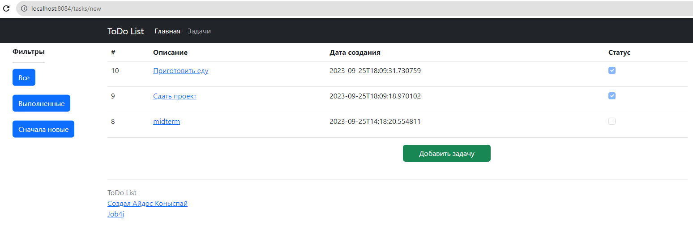
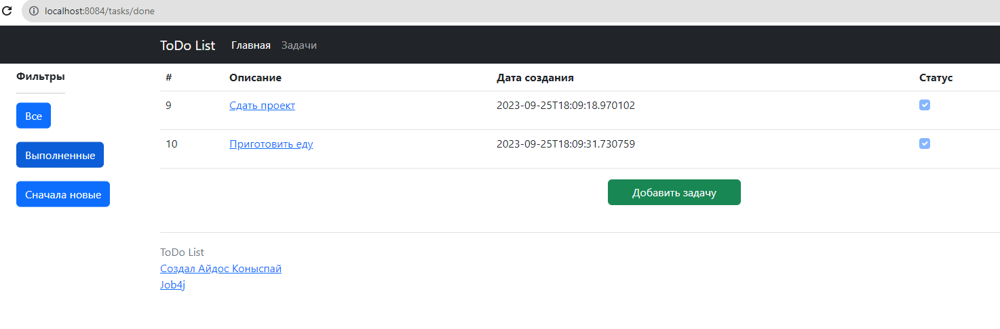
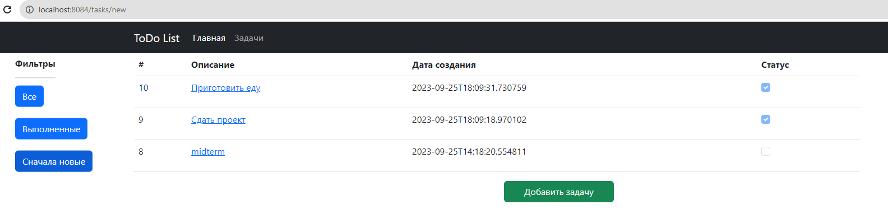
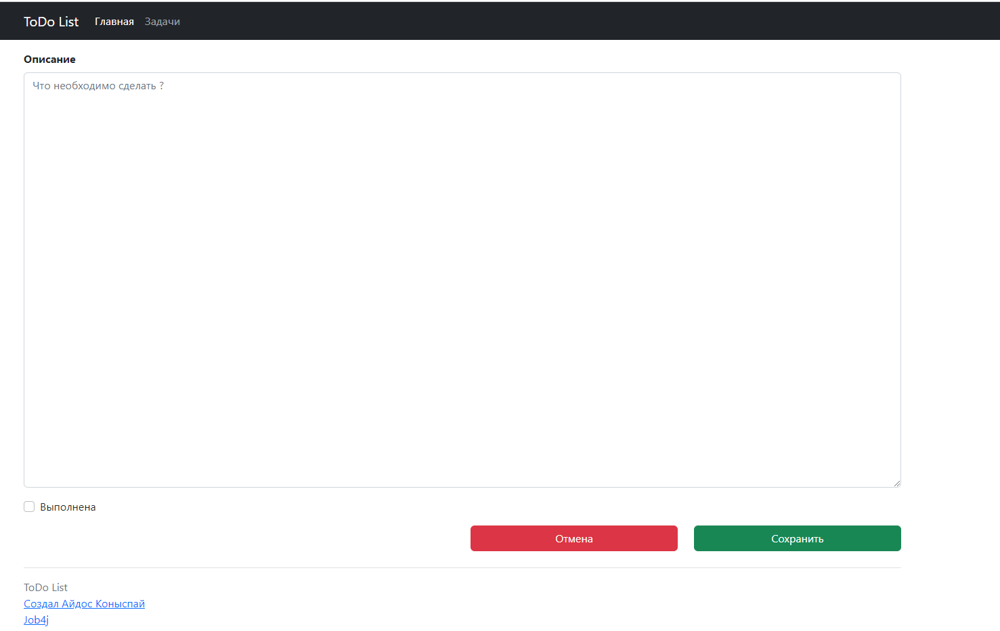
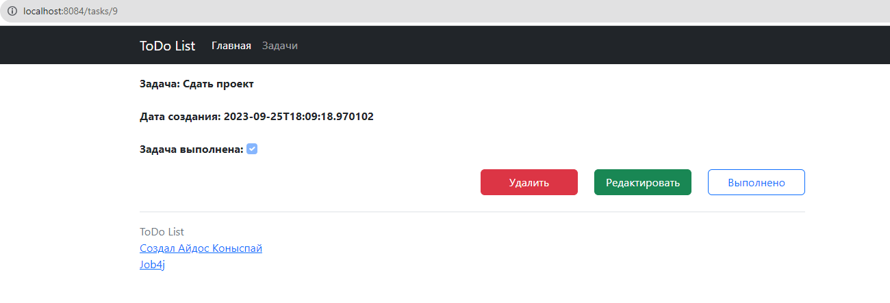
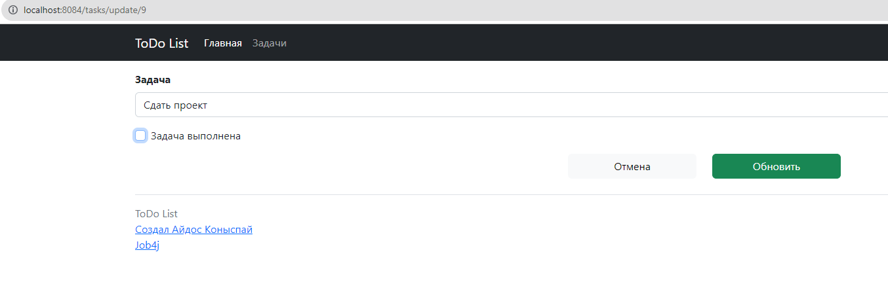
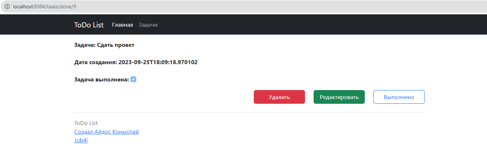
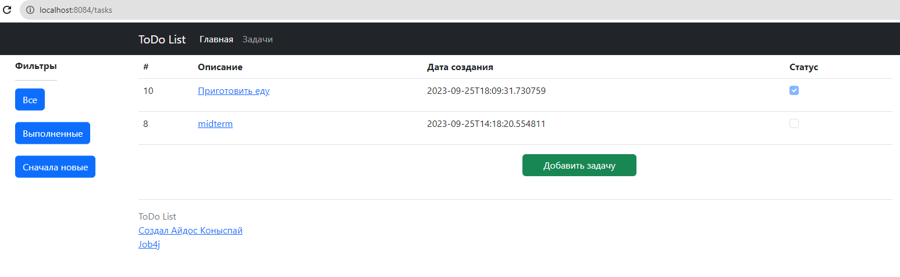

# Simple "TO DO List" Project

## Описание проекта:

#### - Страница со списком всех заданий. В таблице отображаем имя, дату создания и состояние (выполнено или нет)

#### - На странице со списком есть кнопка "Добавить задание".

#### - На странице со списком есть кнопка "Добавить задание".

#### - На странице со списком есть три ссылки: "Все", "Выполненные", "Новые".При переходе по ссылкам в таблице отображается: все задания, только выполненные или только новые.

## Стек технологий

#### - Java 17, Spring boot, Thymeleaf, Bootstrap, Hibernate, PostgreSql

## Требования к окружению

#### - Java 17, Maven 4.0, PostgreSQL 15

## Запуск проекта

#### - Создание бд в СУБД

```sql
create database todo;
```

#### - Создание таблиц в бд из файла /scripts/001_ddl_create_initial_schema.sql

```sql
CREATE TABLE tasks (
                      id SERIAL PRIMARY KEY,
                      description TEXT,
                      created TIMESTAMP,
                      done BOOLEAN
);
```

## Взаимодействие с приложением
1) Список всех заданий

2) Фильтр выполненных заданий

3) Фильтр новых заданий

4) Создание задания

5) Страница с заданием

6) Редактирование задания 

7) Выполнение задания

8) Удаление задания



## Контакты
#### - @urmoonfriend
